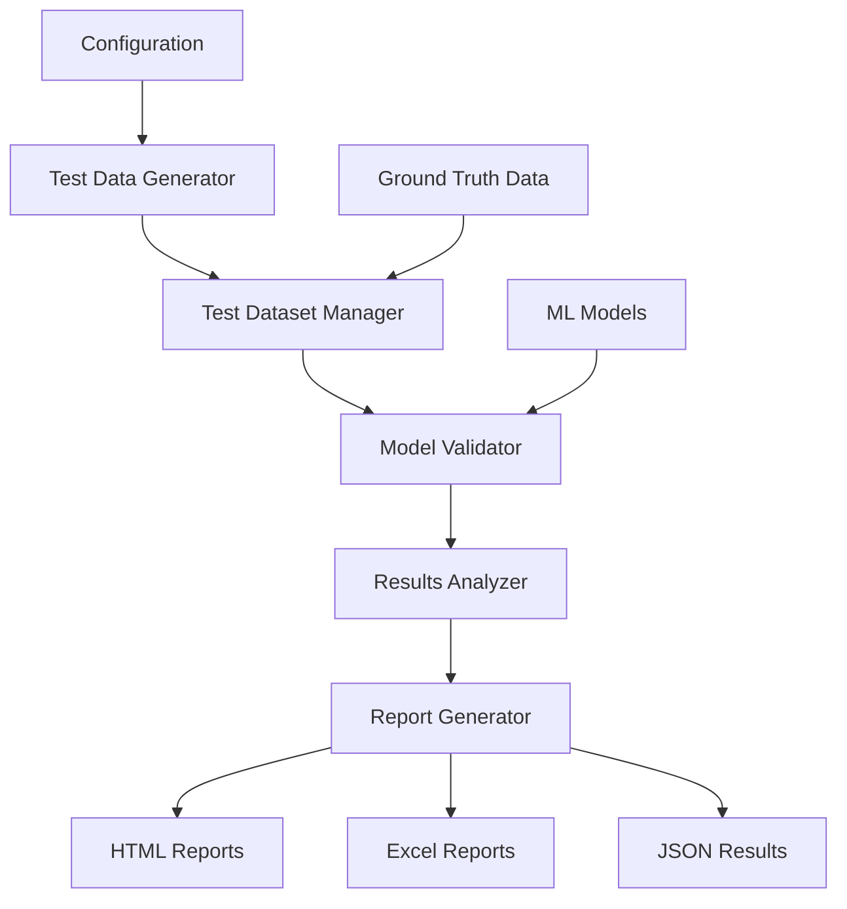

# Design Document - Test Validation System

## Overview

Hệ thống Test Validation được thiết kế để đánh giá độ chính xác của các mô hình phân loại sinh viên bằng cách tạo ra các tập dữ liệu test khác nhau và so sánh kết quả dự đoán với ground truth data. Hệ thống hỗ trợ nhiều loại test scenarios và tạo báo cáo chi tiết về performance của mô hình.

## Architecture

### High-Level Architecture



### System Components

1. **Test Data Generator**: Tạo các tập dữ liệu test với các đặc điểm khác nhau
2. **Test Dataset Manager**: Quản lý và lưu trữ các test datasets
3. **Model Validator**: Chạy mô hình trên test data và thu thập kết quả
4. **Results Analyzer**: Phân tích và so sánh kết quả với ground truth
5. **Report Generator**: Tạo báo cáo chi tiết dưới nhiều định dạng

## Components and Interfaces

### 1. Test Data Generator

```python
class TestDataGenerator:
    def generate_balanced_dataset(self, size: int, distribution: Dict[str, float]) -> TestDataset
    def generate_edge_case_dataset(self, size: int, scenario: str) -> TestDataset
    def generate_realistic_dataset(self, size: int, base_data: List[Dict]) -> TestDataset
    def create_cross_validation_sets(self, data: List[Dict], k_folds: int) -> List[TestDataset]
```

**Các loại test datasets:**
- **Balanced Dataset**: Phân bố đều các nhóm phân loại (25% mỗi nhóm)
- **Imbalanced Dataset**: Phân bố không đều (giống thực tế: 10% Xuất sắc, 30% Khá, 40% Trung bình, 20% Yếu)
- **Edge Case Dataset**: Tập trung vào các trường hợp biên (điểm cao-thời gian ngắn, điểm thấp-hành vi tốt)
- **Realistic Dataset**: Dựa trên dữ liệu thực từ CSV/Supabase

### 2. Test Dataset Manager

```python
class TestDataset:
    dataset_id: str
    name: str
    description: str
    data: List[Dict]
    ground_truth: List[str]
    metadata: Dict
    created_at: datetime
    
class TestDatasetManager:
    def save_dataset(self, dataset: TestDataset) -> str
    def load_dataset(self, dataset_id: str) -> TestDataset
    def list_datasets(self) -> List[TestDataset]
    def validate_dataset(self, dataset: TestDataset) -> ValidationResult
```

### 3. Model Validator

```python
class ModelValidator:
    def validate_single_model(self, model: Any, dataset: TestDataset) -> ValidationResult
    def validate_multiple_models(self, models: List[Any], dataset: TestDataset) -> List[ValidationResult]
    def cross_validate(self, model: Any, datasets: List[TestDataset]) -> CrossValidationResult
```

### 4. Results Analyzer

```python
class ValidationResult:
    model_name: str
    dataset_id: str
    predictions: List[str]
    ground_truth: List[str]
    accuracy_overall: float
    accuracy_by_class: Dict[str, float]
    confusion_matrix: np.ndarray
    inference_time: float
    timestamp: datetime

class ResultsAnalyzer:
    def calculate_accuracy_metrics(self, result: ValidationResult) -> AccuracyMetrics
    def generate_confusion_matrix(self, result: ValidationResult) -> ConfusionMatrix
    def compare_models(self, results: List[ValidationResult]) -> ModelComparison
    def analyze_error_patterns(self, result: ValidationResult) -> ErrorAnalysis
```

## Data Models

### TestDataset Schema

```json
{
  "dataset_id": "test_001",
  "name": "Balanced Classification Test",
  "description": "Tập test với phân bố đều 4 nhóm phân loại",
  "size": 200,
  "distribution": {
    "Xuất sắc": 0.25,
    "Khá": 0.25,
    "Trung bình": 0.25,
    "Yếu": 0.25
  },
  "data": [
    {
      "student_id": 1001,
      "name": "Test Student 001",
      "csv_data": {
        "total_score": 8.5,
        "midterm_score": 8.0,
        "final_score": 9.0,
        "attendance_rate": 0.95,
        "behavior_score_100": 85
      },
      "courses": {
        "Nhập Môn Lập Trình": {
          "score": 8.5,
          "time_minutes": 120
        }
      }
    }
  ],
  "ground_truth": ["Xuất sắc", "Khá", "Trung bình", "Yếu"],
  "metadata": {
    "created_at": "2024-12-12T10:00:00Z",
    "source": "generated",
    "scenario": "balanced"
  }
}
```

### ValidationResult Schema

```json
{
  "validation_id": "val_001",
  "model_name": "K-means + KNN",
  "dataset_id": "test_001",
  "results": {
    "accuracy_overall": 0.85,
    "accuracy_by_class": {
      "Xuất sắc": 0.90,
      "Khá": 0.82,
      "Trung bình": 0.78,
      "Yếu": 0.88
    },
    "confusion_matrix": [[45, 3, 2, 0], [2, 41, 6, 1], [1, 5, 39, 5], [0, 1, 3, 46]],
    "precision": {"Xuất sắc": 0.94, "Khá": 0.82, "Trung bình": 0.78, "Yếu": 0.88},
    "recall": {"Xuất sắc": 0.90, "Khá": 0.82, "Trung bình": 0.78, "Yếu": 0.92},
    "f1_score": {"Xuất sắc": 0.92, "Khá": 0.82, "Trung bình": 0.78, "Yếu": 0.90}
  },
  "performance": {
    "inference_time_ms": 45.2,
    "memory_usage_mb": 12.5
  },
  "timestamp": "2024-12-12T10:30:00Z"
}
```

## Error Handling

### Validation Errors

```python
class ValidationError(Exception):
    pass

class DatasetValidationError(ValidationError):
    def __init__(self, dataset_id: str, errors: List[str]):
        self.dataset_id = dataset_id
        self.errors = errors

class ModelValidationError(ValidationError):
    def __init__(self, model_name: str, error_message: str):
        self.model_name = model_name
        self.error_message = error_message
```

### Error Handling Strategy

1. **Dataset Validation**: Kiểm tra tính hợp lệ của dữ liệu trước khi test
2. **Model Loading**: Xử lý lỗi khi load mô hình từ file
3. **Prediction Errors**: Bắt lỗi trong quá trình dự đoán
4. **Resource Management**: Quản lý memory và file handles
5. **Graceful Degradation**: Tiếp tục test với các mô hình khác nếu một mô hình lỗi

## Testing Strategy

### Unit Tests

1. **TestDataGenerator Tests**
   - Test tạo balanced dataset
   - Test tạo edge case scenarios
   - Test validation logic

2. **ModelValidator Tests**
   - Test với mock models
   - Test error handling
   - Test performance measurement

3. **ResultsAnalyzer Tests**
   - Test accuracy calculations
   - Test confusion matrix generation
   - Test model comparison logic

### Integration Tests

1. **End-to-End Validation**
   - Test complete workflow từ tạo dataset đến báo cáo
   - Test với real models (K-means, KNN, RandomForest)
   - Test với different dataset sizes

2. **Performance Tests**
   - Test với large datasets (1000+ samples)
   - Memory usage monitoring
   - Inference time benchmarks

### Test Scenarios

1. **Scenario 1: Perfect Model**
   - Ground truth = Predictions
   - Expected accuracy = 100%

2. **Scenario 2: Random Model**
   - Random predictions
   - Expected accuracy ≈ 25% (4 classes)

3. **Scenario 3: Biased Model**
   - Model luôn predict "Khá"
   - Test precision/recall metrics

4. **Scenario 4: Real Model Performance**
   - Test với existing StudentClassifier
   - Compare với baseline results

## Implementation Details

### File Structure

```
test_validation_system/
├── core/
│   ├── __init__.py
│   ├── data_generator.py
│   ├── dataset_manager.py
│   ├── model_validator.py
│   └── results_analyzer.py
├── models/
│   ├── __init__.py
│   └── model_interfaces.py
├── reports/
│   ├── __init__.py
│   ├── html_generator.py
│   └── excel_generator.py
├── tests/
│   ├── test_data_generator.py
│   ├── test_model_validator.py
│   └── test_integration.py
├── data/
│   ├── test_datasets/
│   └── validation_results/
└── main.py
```

### Configuration

```python
# config.py
TEST_CONFIG = {
    "datasets": {
        "balanced_size": 200,
        "imbalanced_size": 300,
        "edge_case_size": 100
    },
    "models": {
        "kmeans_knn": "models/student_classifier.py",
        "random_forest": "models/rf_classifier.pkl",
        "knn_only": "models/knn.pkl"
    },
    "output": {
        "results_dir": "data/validation_results/",
        "reports_dir": "reports/output/"
    },
    "performance": {
        "max_inference_time_ms": 1000,
        "max_memory_usage_mb": 100
    }
}
```

### Integration với Existing System

Hệ thống sẽ tích hợp với:

1. **StudentClassifier**: Sử dụng existing classifier làm model chính
2. **Data Generator**: Sử dụng existing data generation logic
3. **Supabase**: Load ground truth data từ database
4. **CSV Data**: Fallback data source

### Performance Considerations

1. **Memory Management**: Lazy loading cho large datasets
2. **Parallel Processing**: Multi-threading cho multiple model validation
3. **Caching**: Cache model predictions để tránh re-computation
4. **Batch Processing**: Process data theo batches để tối ưu memory

## Report Generation

### HTML Report Features

1. **Executive Summary**: Tổng quan accuracy của tất cả models
2. **Detailed Metrics**: Precision, Recall, F1-score cho từng class
3. **Confusion Matrix Visualization**: Interactive heatmaps
4. **Performance Charts**: Accuracy trends, inference time comparison
5. **Error Analysis**: Chi tiết các prediction errors

### Excel Report Features

1. **Summary Sheet**: Bảng tổng hợp tất cả results
2. **Model Comparison**: Side-by-side comparison
3. **Dataset Details**: Thông tin chi tiết về test datasets
4. **Raw Data**: Predictions và ground truth data
5. **Charts**: Built-in Excel charts cho visualization